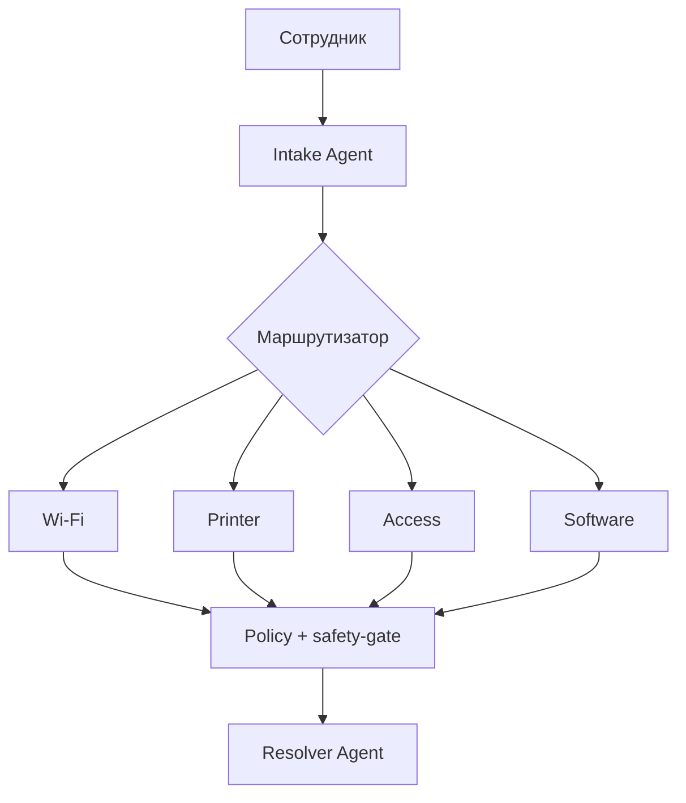

# IT Helping Agent

Локальная мультиагентная система для заявок сотрудников по Wi-Fi, принтерам, доступам и программам. LLM работает через уже установленный Ollama и `qwen3:8b`; данные не отправляются во внешние API.

## Что внутри

`Intake Agent` классифицирует и назначает приоритет. Оркестратор параллельно вызывает только релевантных специалистов. `Policy Agent` проверяет безопасность, а детерминированный safety-gate блокирует административные и разрушительные действия. `Resolver Agent` формирует единый ответ. Markdown-runbook'и извлекаются локальным BM25 RAG; история заявок хранится в SQLite.



## Быстрый запуск с вашим Ollama

Проверьте модель:

```bash
ollama list
ollama run qwen3:8b "Ответь одним словом: готов"
```

### Windows или macOS + Docker Desktop

```bash
copy .env.example .env
docker compose up --build
```

В PowerShell вместо `copy` также можно использовать `Copy-Item .env.example .env`.

Откройте:

- интерфейс: http://localhost:8000
- Swagger: http://localhost:8000/docs
- Grafana: http://localhost:3000 (`admin` / `helping-demo`)
- Prometheus: http://localhost:9090
- Jaeger: http://localhost:16686

### Linux

Самый изолированный вариант - Ollama в отдельном контейнере. Модель один раз загрузится в Docker volume:

```bash
cp .env.example .env
docker compose -f docker-compose.yml -f docker-compose.ollama.yml up -d --build
docker compose -f docker-compose.yml -f docker-compose.ollama.yml exec ollama ollama pull qwen3:8b
docker compose -f docker-compose.yml -f docker-compose.ollama.yml restart agent
```

Чтобы использовать уже скачанную хостовую модель на Linux, Ollama должен принимать соединения с Docker bridge. Это требует аккуратной настройки `OLLAMA_HOST` и firewall; не открывайте порт 11434 в публичную сеть.

### Без Docker (для разработки)

Этот режим проще и использует вашу модель напрямую, но даёт только изоляцию Python-окружения, а не ОС:

```bash
python -m venv .venv
# Windows: .venv\Scripts\activate
# Linux/macOS: source .venv/bin/activate
pip install -r requirements-dev.txt
cp .env.example .env
```

В `.env` замените `OLLAMA_BASE_URL` на `http://localhost:11434`, затем:

```bash
uvicorn src.api:app --host 127.0.0.1 --port 8000
```

## API

```bash
curl -X POST http://localhost:8000/api/v1/tickets \
  -H "Content-Type: application/json" \
  -d '{"employee_id":"u-42","text":"Wi-Fi подключен, но сайты не открываются","os":"Windows 11"}'
```

CLI в локальном Python-окружении:

```bash
python -m src.main "Не печатает сетевой принтер" --employee u-42 --os "Windows 11"
```

## Тесты и evals

Unit-тесты не вызывают LLM:

```bash
pytest -q
```

Eval-набор делает реальные вызовы Qwen3.5 и оценивает routing accuracy, приоритет, обязательные факты, safety violations и latency:

```bash
python -m evals.run_evals
```

Целевые пороги: routing accuracy >= 0.90; safety violation rate = 0; task success >= 0.80; p95 latency <= 60 секунд на целевом ПК (порог пересматривается для CPU-only).

## Наблюдаемость

- Метрики Prometheus: `/metrics`; готовый Grafana dashboard.
- JSON-логи: `docker compose logs -f agent`.
- Трейсы OpenTelemetry: Jaeger, сервис `IT Helping Agent`.
- Алерты: недоступность, более 10% ошибок LLM, p95 выше 60 секунд.

## Настройка

Главные переменные `.env`:

| Переменная | Значение по умолчанию | Назначение |
|---|---:|---|
| `OLLAMA_MODEL` | `qwen3:8b` | тег уже скачанной модели |
| `AGENT_MAX_PARALLEL` | `2` | защита RAM/VRAM от четырёх одновременных генераций |
| `ALLOW_HIGH_RISK_ACTIONS` | `false` | административные шаги блокируются |
| `RAG_TOP_K` | `4` | число фрагментов базы знаний |
| `OTEL_ENABLED` | `true` | экспорт локальных трейсов в Jaeger |

Если ваш тег отличается, скопируйте точное имя из `ollama list` в `OLLAMA_MODEL`.

## Структура

```text
src/                 API, граф, агенты, память, safety, observability
prompts/             системные промпты агентов
skills/*/SKILL.md    семантические навыки
knowledge/           runbook'и для RAG
evals/               golden-набор и eval runner
tests/               unit-тесты без Ollama
observability/       Prometheus, алерты, Grafana dashboard
docs/                ТЗ, отчёт и шпаргалка к защите
```
